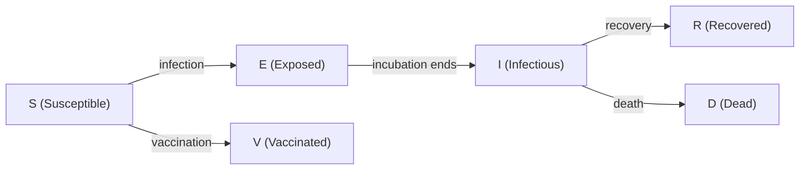

# 🔬 WBEPI → PDX Integration: Full Analysis

## TL;DR — What This Is

**wbepi** is a **stochastic epidemic simulator** built by the **World Bank Group** / **London School of Tropical Medicine (LSTM)** — authored by **Thibaut Jombart**. It's an R package that simulates disease outbreaks across multiple connected populations, with built-in reactive interventions (vaccination, response triggers).

The integration brief (authored by **Isaias Fernandes**, ML Specialist, WHO AFRO) is a **scoping document** proposing to embed this engine into PDX's **Predictions Dashboard** as a **Scenario & Response Engine**.

> [!IMPORTANT]
> This is **NOT a forecaster**. It's a **counterfactual engine** — it answers *"What would happen IF we do X response?"* — not *"Will an outbreak happen?"*. This is the missing analytical layer before cost-effectiveness analysis can be added to PDX.

---

## 1. What the Engine Actually Does

### The SEIRDV Model

It models disease progression through **6 compartments**:



### Key Capabilities

| Feature | What It Does |
|---------|-------------|
| **Stochastic simulation** | Every transition uses Binomial draws — gives you a **distribution of outcomes**, not a single line |
| **Metapopulation** | Supports N populations (districts/provinces/countries) linked by a spatial diffusion matrix |
| **Spatial diffusion** | Force of infection spreads between populations (people don't move, disease pressure does) |
| **Reactive intervention** | Populations enter "response mode" after `interv_delay` days, reducing transmission + triggering vaccination |
| **Two vaccination modes** | Global (fixed % of susceptibles) or Targeted (ring vaccination — X contacts per case) |
| **Response release** | Intervention stops after `interv_release` days with zero cases |
| **Multiple simulations** | Run N independent simulations to get uncertainty bands |

### Parameters (the knobs you turn)

| Parameter | Meaning | Example |
|-----------|---------|---------|
| `β` (beta) | Transmission rate | 0.2 |
| `σ` (sigma) | 1/incubation period | 1/7 (1 week) |
| `γ` (gamma) | 1/illness duration | 1/14 (2 weeks) |
| `μ` (mu) | Case fatality ratio | 0.3 (30%) |
| `interv_delay` | Days until response activates | 10 |
| `interv_efficacy` | % transmission reduction during response | 0.25 |
| `target_size` | People vaccinated per case (ring vaccination) | 200 |
| `diffusion` | % of FOI spreading to other populations | 0.10 |

### Output Shape

Long-format table: **one row per (simulation × time_step)**, with per-population columns for S, E, I, R, D, V, and response status. The shipped toy dataset is 4 populations × 365 days × 10 simulations = **3,650 rows × 30 columns**.

---

## 2. Technical Architecture of the R Package

### File Structure

```
wbepi-main/
├── R/
│   ├── run_seirdv.R          # Main entry point (253 lines)
│   ├── build_seirdv.R        # Compiles the odin model
│   ├── odin.R                # R6 class wrapper (auto-generated by odin)
│   ├── process_inputs.R      # Input validation orchestrator
│   ├── process_delta.R       # Spatial diffusion matrix builder
│   ├── process_ini_compartment.R  # Initial state recycling
│   ├── process_n_populations.R    # Population count validation
│   ├── process_time.R        # Time vector builder
│   ├── process_interv_vacc_type.R # Vaccination mode validation
│   ├── check_rate.R          # Rate validators
│   ├── check_proportion.R    # Proportion validators
│   └── dynlib.R              # Dynamic library loading
├── inst/odin/seirdv.R        # 🔑 THE ACTUAL MODEL (239 lines of odin DSL)
├── src/odin.c                # Auto-generated C implementation (1133 lines)
├── tests/testthat/           # Comprehensive test suite
├── vignettes/                # Mathematical model description (with PDF)
└── toy_data.xlsx             # Reference output (canonical)
```

### Core Model (odin DSL) — The Heart

The actual model definition is in `inst/odin/seirdv.R` — only **239 lines** of domain-specific odin syntax. This is what gets compiled to C. Key equations:

```r
# State transitions
update(S[]) <- S[i] - n_S_E[i] - n_S_V[i]
update(E[]) <- E[i] + n_S_E[i] - n_E_I[i]
update(I[]) <- I[i] + n_E_I[i] - n_I_R[i] - n_I_D[i]
update(R[]) <- R[i] + n_I_R[i]
update(D[]) <- D[i] + n_I_D[i]
update(V[]) <- V[i] + n_S_V[i]

# Stochastic transitions (Binomial draws)
n_E_I[] <- if (E[i] > 0) rbinom(E[i], 1 - exp(-sigma)) else 0
n_I_out[] <- if (I[i] > 0) rbinom(I[i], 1 - exp(-gamma)) else 0
n_I_R[] <- if (n_I_out[i] > 0) rbinom(n_I_out[i], 1 - mu) else 0
```

### Quality Assessment

| Aspect | Rating | Notes |
|--------|--------|-------|
| **Code quality** | ⭐⭐⭐⭐ | Clean, well-documented R code with proper roxygen |
| **Test coverage** | ⭐⭐⭐⭐⭐ | 500+ lines of tests covering every feature: defaults, dimensions, progression, spatial, vaccination, mortality, intervention triggers, response release |
| **Documentation** | ⭐⭐⭐⭐ | Full mathematical vignette with LaTeX equations, plus inline comments |
| **Model validation** | ⭐⭐⭐ | Tests use extreme parameters (β=1e6) to force deterministic behavior — smart approach for testing stochastic models |
| **Production readiness** | ⭐⭐ | Research artefact, not a production service. Version 0.1.0.999 (dev version) |

---

## 3. What the Integration Brief Proposes

### The Vision

Embed wbepi into PDX's Predictions Dashboard so decision-makers can ask:

> *"If we trigger ring vaccination 7 days after detection in District X, with 200 contacts vaccinated per case, what's the distribution of outbreak sizes over the next 90 days versus doing nothing?"*

### Three Architectural Options Evaluated

| Option | Description | Recommendation |
|--------|-------------|---------------|
| **A — Embedded in Predictions Dashboard** ✅ | New "Scenario & Response" section in existing Predictions | **RECOMMENDED** — single decision workflow |
| **B — Standalone PDX Module** | Separate top-level navigation item | Fragments the decision workflow |
| **C — Backend Microservice** | Standalone API consumed by multiple PDX modules | Strategic destination, but too early now |

### The Recommended Build Plan (5 Sprints)

| Sprint | Deliverable | Owner |
|--------|-------------|-------|
| **Sprint 1** | Port engine to Python, validate against R toy dataset, FastAPI scaffold | ML Specialist |
| **Sprint 2** | Parameter-fitting layer (Bayesian estimation of β,σ,γ,μ from country data), async execution | ML + Backend |
| **Sprint 3** | Predictions Dashboard UI — scenario configurator, trajectory plots, uncertainty bands | Frontend |
| **Sprint 4** | Cost-effectiveness layer (DALYs, deaths averted, ICERs vs WHO-CHOICE thresholds) | ML + Backend |
| **Sprint 5** | Expose scenario API to OneHealth, Decision WHO, Risk Sentinel | Backend |

### Key Decision: Wrap R or Re-implement in Python?

**Answer: Re-implement in Python.** Rationale:
- The model is small (~239 lines of core logic)
- Validation against the toy dataset is tractable
- Keeps PDX stack monolingual (no R dependency in production)
- Avoids rpy2/subprocess bridge complexity

---

## 4. What's Missing (Must-Build)

> [!WARNING]
> Two things are **non-negotiable** before this can power a dashboard:

### 1. Parameter Fitting Layer
The package takes β, σ, γ, μ as **inputs** — it does NOT estimate them from data. We must build:
- Bayesian estimation of parameters from country case data
- Credible intervals on parameter estimates
- Pathogen-specific parameter libraries (start with: cholera, Mpox, measles, meningitis, Ebola)

### 2. Cost-Effectiveness Layer (The Strategic Destination)
This is why the engine exists in PDX:
- Monetise DALYs averted and deaths averted from simulation draws
- Pull intervention costs from unit-cost reference tables
- Compute ICER distributions (not point estimates)
- Compare against WHO-CHOICE thresholds per country

**Example decision-grade output:**
> *"Ring vaccination starting at day 7 with target_size = 200 is cost-effective in 87% of simulations at the WHO-CHOICE threshold for Country X. Median ICER: USD 245 per DALY averted (95% CI: USD 110–520)."*

---

## 5. Honest Limitations

| Limitation | Impact | Workaround |
|-----------|--------|-----------|
| No age structure / contact matrices | Can't model age-targeted interventions | Acceptable for short outbreak windows |
| No waning immunity / reinfection | Weak for endemic disease or multi-wave dynamics | Not a concern for acute outbreak scenarios |
| No vital dynamics (births, non-disease deaths) | Closed population assumption | Fine for short horizons (< 1 year) |
| Single pathogen at a time | No co-circulation modeling | Run separate scenarios |
| No data fitting built in | Parameters are pure inputs | **Must build** (Sprint 2) |
| R-only implementation | Can't call from Python backend | **Must port** (Sprint 1) |

---

## 6. Risks the Brief Flags

| Risk | Status | Action Required |
|------|--------|----------------|
| **LSTM attribution** | LSTM = London School of Tropical Medicine, NOT the neural network | Must be explicit in all docs/UI/comms |
| **Licensing for sovereign deployments** | MIT license permits it, but need written World Bank confirmation | Legal check before Member State deployments |
| **Package version pinning** | Using dev version 0.1.0.999 | Pin to specific commit hash |
| **Attribution language** | Must credit World Bank + Thibaut Jombart / LSTM | Ethical obligation + relationship asset |
| **Parameter sources** | Need published literature priors for each pathogen | Build reference library |
| **Historical validation** | Must validate against at least one real outbreak (e.g., 2018 DRC Ebola) before going live | Credibility check for Ministers |

---

## 7. My Assessment: What This Means for PDX

### 🟢 The Good

1. **This is genuinely valuable.** Counterfactual scenario modeling is the analytical gap between "here's what's happening" (current PDX) and "here's what you should do about it" (decision support). This fills that gap.

2. **The engine is well-built.** Clean code, proper tests, mathematical documentation. Thibaut Jombart is a legit epidemiologist (not some random contributor).

3. **The integration brief is exceptionally thorough.** Whoever wrote this (Isaias) clearly understands both the epidemiology and the engineering trade-offs. The 5-sprint plan is realistic.

4. **The cost-effectiveness layer is the killer feature.** Going from "here are trajectory distributions" to "here's the cost per DALY averted with uncertainty bands" is what makes this a decision-grade tool, not just a visualization.

5. **The Python port is feasible.** 239 lines of core model logic + NumPy/SciPy for Binomial draws = very tractable re-implementation.

### 🟡 Concerns

1. **Sprint estimates feel tight.** Bayesian parameter fitting + validation against real outbreaks (Sprint 2) is significant ML work. Budget for slippage.

2. **Parameter fitting is the real challenge** — not the simulator port. Getting reliable β, σ, γ, μ estimates from noisy, delayed, incomplete African country surveillance data is hard. The brief acknowledges this but doesn't fully scope the data pipeline.

3. **The cost-effectiveness layer needs health economics expertise**, not just engineering. WHO-CHOICE thresholds, DALY calculations, and unit cost tables are domain-specific. Make sure you have the right advisor.

### 🔴 What to Watch

1. **Don't ship without historical validation.** Running a known outbreak (like 2018 DRC Ebola) through the simulator and comparing to actual outcomes is the credibility check that will make or break ministerial trust.

2. **The "LSTM" confusion is real.** Anyone who sees "LSTM" will think neural network. This needs aggressive disambiguation in every piece of documentation.

---

## 8. Key Questions for You

1. **Who's the ML specialist doing the Python port and parameter fitting?** Is it Isaias himself, or is this being assigned to someone else?

2. **Do you have the pathogen parameter literature ready?** The brief says start with cholera, Mpox, measles, meningitis, and Ebola — do you have published papers for β, σ, γ, μ priors for these?

3. **Has the World Bank given written confirmation for sovereign deployment licensing?**

4. **Is this Sprint 1 starting now, or are you still in the "should we do this" evaluation phase?**

5. **How does this interact with your current multi-tenancy work?** Scenario data would need to be tenant-scoped under RLS, and async simulation runs would need the same APScheduler tenant-wrapping you just finished in Phase 5.
