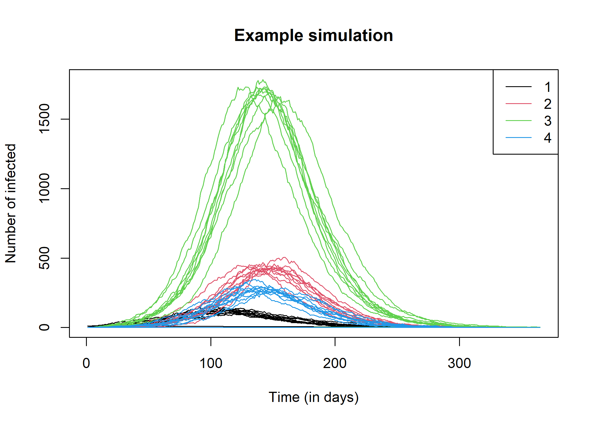

<!-- README.md is generated from README.Rmd. Please edit that file. -->
<!-- The code to render this README is stored in .github/workflows/render-readme.yaml -->
<!-- Variables marked with double curly braces will be transformed beforehand: -->
<!-- `packagename` is extracted from the DESCRIPTION file -->
<!-- `gh_repo` is extracted via a special environment variable in GitHub Actions -->

Generate a toy dataset:

``` r

library(wbepi)

set.seed(1)
x <- run_seirdv(
  n_populations = 4, 
  ini_S = c(1000, 3000, 12000, 2000),
  ini_I = c(10, 0, 0, 1), 
  beta = 0.2,
  sigma = 1/7, # 1 week incubation time
  gamma = 1/14, # 2 week disease duration
  mu = 0.3, # 30% mortality
  interv_delay = 10, # response takes place 10 days after first case
  interv_efficacy = 0.25, # response removes 25% infectiousness
  interv_vacc_type = 2L,
  target_size = 200, # 200% people vaccinated per case
  interv_release = 28, # stop response after 28 days without case
  time = 365, # 1 year of simulation
  diffusion = 0.1, # 10% diffusion of infections
  n_sims = 10 # 10 independent simulations
)
```

We can check the results:

``` r

dim(x)
#> [1] 3650   30
head(x)
#>   sim step S[1] S[2]  S[3] S[4] E[1] E[2] E[3] E[4] I[1] I[2] I[3] I[4] R[1]
#> 1   1    1 1000 3000 12000 2000    0    0    0    0   10    0    0    1    0
#> 2   1    2  998 2999 12000 1999    2    1    0    1   10    0    0    1    0
#> 3   1    3  997 2999 12000 1998    2    1    0    2   11    0    0    1    0
#> 4   1    4  993 2999 11999 1998    6    1    1    0   11    0    0    3    0
#> 5   1    5  991 2999 11998 1998    8    1    2    0   11    0    0    2    0
#> 6   1    6  990 2998 11997 1997    7    2    2    1   13    0    1    2    0
#>   R[2] R[3] R[4] D[1] D[2] D[3] D[4] V[1] V[2] V[3] V[4] status[1] status[2]
#> 1    0    0    0    0    0    0    0    0    0    0    0         0         0
#> 2    0    0    0    0    0    0    0    0    0    0    0         0         0
#> 3    0    0    0    0    0    0    0    0    0    0    0         0         0
#> 4    0    0    0    0    0    0    0    0    0    0    0         0         0
#> 5    0    0    1    0    0    0    0    0    0    0    0         0         0
#> 6    0    0    1    0    0    0    0    0    0    0    0         0         0
#>   status[3] status[4]
#> 1         0         0
#> 2         0         0
#> 3         0         0
#> 4         0         0
#> 5         0         0
#> 6         0         0
tail(x)
#>      sim step S[1] S[2] S[3] S[4] E[1] E[2] E[3] E[4] I[1] I[2] I[3] I[4] R[1]
#> 3645  10  360   94  338 1141  181    0    0    0    0    0    0    2    0  634
#> 3646  10  361   94  338 1141  181    0    0    0    0    0    0    2    0  634
#> 3647  10  362   94  338 1141  181    0    0    0    0    0    0    2    0  634
#> 3648  10  363   94  338 1141  181    0    0    0    0    0    0    2    0  634
#> 3649  10  364   94  338 1141  181    0    0    0    0    0    0    2    0  634
#> 3650  10  365   94  338 1140  181    0    0    1    0    0    0    2    0  634
#>      R[2] R[3] R[4] D[1] D[2] D[3] D[4] V[1] V[2] V[3] V[4] status[1] status[2]
#> 3645 1860 7628 1237  282  802 3229  583    0    0    0    0         0         0
#> 3646 1860 7628 1237  282  802 3229  583    0    0    0    0         0         0
#> 3647 1860 7628 1237  282  802 3229  583    0    0    0    0         0         0
#> 3648 1860 7628 1237  282  802 3229  583    0    0    0    0         0         0
#> 3649 1860 7628 1237  282  802 3229  583    0    0    0    0         0         0
#> 3650 1860 7628 1237  282  802 3229  583    0    0    0    0         0         0
#>      status[3] status[4]
#> 3645         1         0
#> 3646         1         0
#> 3647         1         0
#> 3648         1         0
#> 3649         1         0
#> 3650         1         0

## general plot
matplot(x[, "step"], x[, grep("I", names(x))],
  type = "l", lty = 1, main = "Example simulation",
  xlab = "Time (in days)", ylab = "Number of infected"
)
legend("topright", "Population", col = 1:4, lty = 1, legend = 1:4)
```



Export results if needed:

``` r
rio::export(x, file = "toy_data.xlsx")
```
