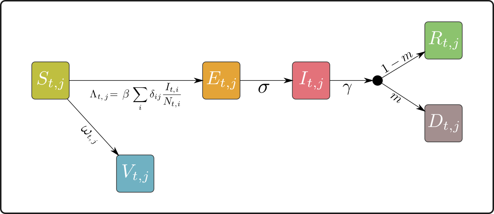

```{r, include = FALSE}
knitr::opts_chunk$set(
  collapse = TRUE,
  comment = "#>"
)

# function to insert new pages
# to call it, use `r pagebreak()`
pagebreak <- function() {
  if(knitr::is_latex_output())
    return("\\newpage")
  else
    return('<div style="page-break-before: always;" />')
}

```

`r pagebreak()`

# The SEIRDV model

## Overview 

The model implemented in _wbepi_ is stochastic SEIRDV model where compartments
are:

- __S__: susceptible individuals
- __E__: exposed, _i.e._ infected but not infectious yet
- __I__: infectious, living individuals
- __R__: recovered individuals, no longer infectious
- __D__: individuals who died from the disease, no longer infectious
- __V__: vaccinated individuals, no longer susceptible

Transitions between compartments are illustrated in the diagram below:

```{r, out.width = "0.75\\textwidth", fig.align="center", echo = FALSE}

```


## Spatialization

The model use a __metapopulation__ structure, where different populations can 
experience different dynamics, and are linked by a spatial structure permitting
the diffusion of transmission from one population to another at every time step.
It is important to note that invididuals themselves do not move. Instead, the 
force of infection (FOI) generated by infectious individuals inside a given 
population can create cases in neighbouring populations. 

Connectivity between populations is expressed through the square matrix 
$\Delta$:

$$
\Delta = \{\delta_{i,j}\} \in \mathbb{R}_+^{K \times K} 
$$

where $K$ is the number of populations, and $\delta_{i,j}$ is the proportion of
infections generated in population $i$ going towards population $j$. 
This matrix needs to be row-standardized (_i.e._ rows sum to one).


## Transitions

Changes in compartments are governed by the equations below. We represent the 
average numbers of individuals. Actual numbers are drawn from binomial 
distributions with corresponding individual rates (see next section).

Time steps are indexed by $t$, while populations are indexed by $j$. We use the
following notations:

- $\beta$: infection rate for a frequency-dependent model
- $\omega_t$: rate of vaccination at time $t$
- $\sigma$: inverse of the mean incubation time
- $\gamma$: inverse of the mean duration of illness
- $m$: case fatality ratio of the disease

All parameters are user-provided, with the exception of $\omega_{t,j}$, which is
calculated from the daily vaccine coverage $c_{t,j}$ and efficacy $e$ as:

$$
\omega_{t,j} = - log(1 - c_{t,j} e)
$$

Note that only vaccine coverage is a function of time and space, and depends on:

- the background daily vaccine coverage
- additional vaccination for patches in response mode

$$
S_{t+1,j} = S_{t,j} - \beta S_{t,j} \sum_i \delta_{ij} \frac{I_{t,j}}{N_{t,j}} - \omega_{t,j} S_{t,j}
$$

$$
E_{t+1,j} = E_{t,j} + \beta S_{t,j} \sum_i \delta_{ij} \frac{I_{t,j}}{N_{t,j}} - \sigma E_{t,j}
$$

$$
I_{t+1,j} = I_{t,j} + \sigma E_{t,j} - \gamma E_{t,j}
$$

$$
R_{t+1,j} = R_{t,j} + \gamma (1 - m) E_{t,j}
$$

$$
D_{t+1,j} = D_{t,j} + \gamma m E_{t,j}
$$

$$
V_{t+1,j} = V_{t,j} + \omega_{t,j} S_{t,j}
$$


## Stochasticity

As mentioned above, the equations in the previous sections indicate average 
expectations of state changes. In practice, we implement a stochastic model by:

1. defining the individual rate of transition
2. drawing the number of individuals transitioning using a Binomial distribution

We provide the generic equation, as the same process is used for all compartments. Let $N$ be the number of individuals in the source compartment, $\lambda$ 
be the rate at which individuals leave $N$; the number of individuals leaving 
$N$, denoted $n$, is determined as:

$$
n \sim \mathcal{B}(N, 1 - e^{-\lambda})
$$

where $\mathcal{B}$ represents the Binomial distribution. 
If individuals can leave $N$ for several compartments (here, maximum 2), we use 
nested Binomial draws. Noting $n_1$ and $n_2$ the number of individuals leaving
to compartment 1 and 2, $\lambda_1$ and $\lambda_2$ the respective individual rates, and $n = n_1 + n_2$, we have:

$$
n \sim \mathcal{B}(N, 1 - e^{-(\lambda_1 + \lambda_2)})
$$

Then:

$$
n_1 \sim \mathcal{B}(n, 1 - e^{-\frac{\lambda_1}{\lambda_1 + \lambda_2}})
$$

And:

$$
n_2 = n - n_1
$$


## Intervention

Interventions is implemented as a reactive process, each population being
handled separately and having two possible states: _naive_ (no response, status
= 0) or in _response_ mode (status = 1). The _response_ is triggered
`interv_delay` days after the first case in the concerned population. It stops
after `interv_release` days with no infected individual.

In _naive_ mode, populations dynamics are handled exactly as described above.
In _response_ mode, two components are altered:

1. transmission from infectious individuals in the population of interest is
reduced by a factor `interv_efficacy`; this means that the resulting infectivity
is $\beta_{\text{response}} = \beta (1 - \text{interv\_efficacy})$

2. additional vaccination is implemented; there are two modes of reactive 
vaccination, determined by the argument `interv_vacc_type`: either "global", (`interv_vacc_type` = 1), where vaccination coverage is increased by a constant 
daily coverage equal to `interv_vacc_coverage`, or "targeted", where vaccination is increased by an average of `target_size` individuals per infected case.

In a meta-population setting, it is in theory possible for a population to
undergo several outbreaks, if it gets re-infected by external populations.

